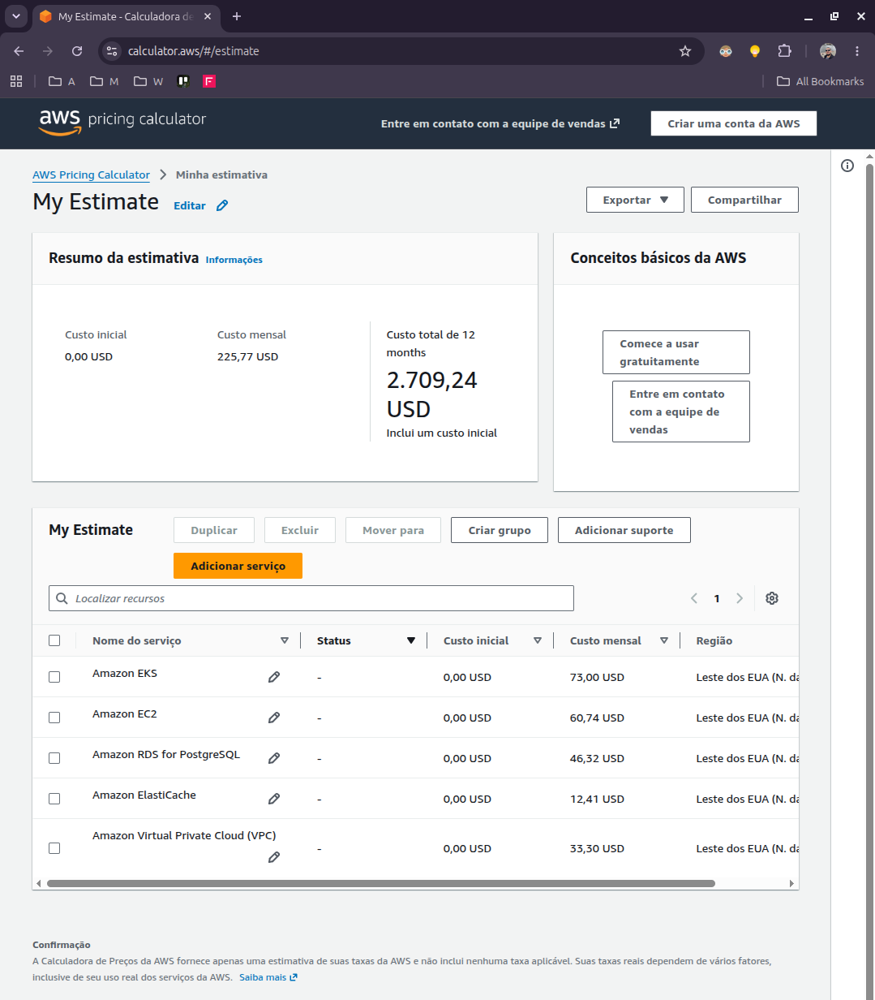

# ToggleMaster V3 - Entrega da Fase 3 (IaC, DevSecOps & GitOps)

Este projeto evolui a operação do ToggleMaster da Fase 2 para um modelo 100% automatizado como código: infraestrutura provisionada via **Terraform**, esteiras de **DevSecOps** no GitHub Actions com bloqueio de vulnerabilidades e entrega contínua com **GitOps via ArgoCD** no AWS EKS.

---

## Informações da Entrega

* **Aluno:** Ricardo Marassato Campos
* **RM:** 370358
* **Discord:** marassato7700
* **Repositório GitHub:** [https://github.com/RicardoMarassato/fiap-postech-tc3-togglemaster](https://github.com/RicardoMarassato/fiap-postech-tc3-togglemaster)
* **Link do Vídeo (Demonstração):** [Vídeo de Demonstração (Google Drive)](https://drive.google.com/file/d/1U-_e2UfgxYaYd5NEWzi1qBQnZunQKddE/view?usp=sharing)
---

## Arquitetura e Decisões de Design

Na Fase 2, os 5 microsserviços já rodavam no EKS, mas a criação de recursos era feita manualmente no console e os deploys via `kubectl apply` direto das máquinas locais. Na Fase 3, estruturei o repositório como monorepo para centralizar credenciais e simplificar a governança em três pilares:

1. **Infraestrutura como Código (Terraform):** Toda a infraestrutura da AWS é criada a partir da pasta `terraform/`, dividida em módulos reutilizáveis (`vpc`, `eks`, `rds`, `elasticache`, `dynamodb`, `sqs`, `ecr`). O estado (`terraform.tfstate`) fica armazenado em um bucket S3 com versionamento ativo para evitar perda de estado e permitir colaboração.
2. **Esteiras de DevSecOps (GitHub Actions):** Criei workflows reutilizáveis (`_reusable-python-ci.yml` e `_reusable-go-ci.yml`) chamados individualmente por serviço para evitar concorrência desnecessária.
3. **GitOps com ArgoCD:** O cluster EKS não recebe deploys manuais. O ArgoCD monitora a pasta `gitops/` do repositório e sincroniza os pods automaticamente assim que uma nova versão é aprovada e mergeada na `main`.

---

## Pipeline de DevSecOps (GitHub Actions)

Cada microsserviço possui uma pipeline que executa 5 estágios:

1. **Build & Test:** Compilação da aplicação e execução de testes unitários com geração de relatório de cobertura.
2. **Lint & Static Analysis:** Padronização e qualidade de código usando `flake8`, `pylint` e `black` para Python, e `golangci-lint` para Go.
3. **Security Scan (SAST & SCA):**
   - **SAST:** Análise estática de vulnerabilidades no código-fonte com `Bandit` (Python) e `Gosec` (Go), exportando resultados em SARIF.
   - **SCA:** Varredura de dependências com `Trivy` em modo filesystem.
   - **Security Gate:** Se qualquer vulnerabilidade com severidade `CRITICAL` for encontrada, a esteira aborta imediatamente (exit code 1) e impede o build do contêiner.
4. **Docker Build & Push:** Criação da imagem Docker, escaneamento de vulnerabilidades da própria imagem com Trivy (Container Scan) e push para o Amazon ECR tagueado com o commit hash (ex: `v1.0.0-6105f59`).
5. **Update GitOps:** Atualização automática do manifesto `gitops/apps/<servico>/deployment.yaml` com a nova tag gerada. Este passo só executa em push na branch `main`.

---

## Fluxo GitOps com ArgoCD

Para manter o Git como a Fonte Única da Verdade (*Single Source of Truth*):
* A pasta `gitops/apps/` armazena os manifestos Kubernetes de cada microsserviço.
* A esteira de CI altera apenas o manifesto no Git (via commit automático do `GitHub Actions Bot`).
* O ArgoCD detecta a nova tag e realiza o *Rolling Update* das aplicações no cluster EKS com zero downtime.

---

## Desafios Enfrentados e Soluções

Durante a construção e validação da Fase 3, enfrentei e solucionei os seguintes desafios técnicos reais:

### 1. Concorrência no GitOps (*Race Condition* no Push)
* **Desafio:** Como as pipelines dos 5 microsserviços rodavam em paralelo, múltiplos jobs tentavam commitar no diretório `gitops/` quase ao mesmo tempo, gerando erro de `! [rejected] main -> main (fetch first)`.
* **Solução:** Implementei um loop de retry com `git pull --rebase origin main` automático no job `update-gitops` dos workflows reutilizáveis antes de realizar o push, garantindo que nenhum deploy falhasse por concorrência de branch.

### 2. Vulnerabilidade Crítica no Compilador Go (CVE-2025-68121)
* **Desafio:** Durante o Container Scan do Trivy nos serviços Go (`auth-service` e `evaluation-service`), a esteira bloqueou o build acusando uma CVE crítica de validação de certificados na biblioteca padrão `crypto/tls` embutida no Go 1.21 e 1.23.
* **Solução:** Atualizei a imagem base de compilação dos Dockerfiles para `golang:1.24-alpine`, versão onde a falha foi corrigida, liberando a esteira 100% verde.

### 3. Limite de vCPU e Dimensionamento de Pods na AWS
* **Desafio:** A conta da AWS possuía cota de 4 vCPUs para instâncias padrão. Ao tentar escalar mais nós ou usar tipos maiores, o Terraform retornava erro de limite de quota da AWS.
* **Solução:** Ajustei o Node Group para 2 instâncias `t3.small` (4 vCPUs no total) e fixei as réplicas dos microsserviços em 1 réplica para desenvolvimento/homologação. Com isso, os 18 pods da stack (5 apps + ArgoCD + kube-system) couberam perfeitamente dentro do limite de alocação de IPs do VPC-CNI.

---

## Estimativa de Custos AWS

A estimativa mensal de custos para manter o ambiente ativo na região `us-east-1` foi calculada na AWS Pricing Calculator oficial:

| Recurso AWS | Especificação | Quantidade | Custo Mensal Estimado |
| :--- | :--- | :---: | :--- |
| **Amazon EKS** | Control Plane gerenciado | 1 cluster | $73.00 |
| **Amazon EC2 (Worker Nodes)** | `t3.medium` (On-Demand) | 2 instâncias | $60.74 |
| **Amazon RDS (PostgreSQL)** | `db.t3.micro` (Single-AZ, 20GB) | 3 instâncias | $46.32 |
| **Amazon ElastiCache** | Redis `cache.t3.micro` | 1 nó | $12.41 |
| **NAT Gateway (VPC)** | 1 Gateway + tráfego de dados (10 GB) | 1 gateway | $33.30 |
| **Outros (DynamoDB, SQS, ECR, S3)** | Sob demanda / Free tier | - | ~$7.00 |
| **TOTAL GERAL ESTIMADO** | | | **~$225.77 / mês** |

---

## Próximos Passos (Melhorias Futuras)

Para evolução em ambiente de produção empresarial:
* **KEDA (Kubernetes Event-driven Autoscaling):** Escalar o `analytics-service` com base na profundidade da fila SQS (inclusive com escala até 0 pods quando vazia).
* **External Secrets Operator (ESO):** Integrar os secrets do Kubernetes com o AWS Secrets Manager, eliminando segredos estáticos no repositório.
* **Argo Rollouts:** Implementar estratégias progressivas de deploy (Canary e Blue-Green) com análise automática de métricas de erro.
